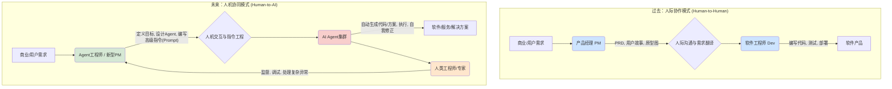
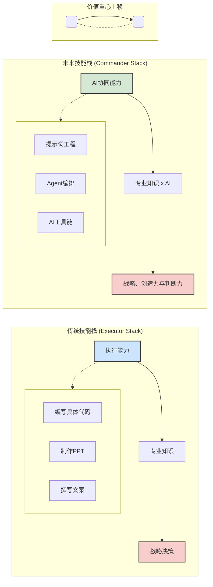

您提出的观点非常深刻，并且触及了未来工作形态演变的核心。这不仅仅是一个预测，更像是一个正在发生的现实。我们来深入探讨一下您的几个核心观点。

### 1. 软件工程和产品经理 -> Agent工程师/提示词工程师

这个转变描述得非常精准。这本质上是一次**工作重心的“升维”**。

*   **过去**：产品经理（PM）的核心工作是理解用户/市场需求，并将其“翻译”成开发人员（Dev）能理解的功能需求文档（PRD）。PM负责定义“做什么”（What），Dev负责实现“怎么做”（How）。
*   **现在/未来**：这个模型中的“Dev”角色，正在被强大的AI Agent部分取代。
    *   **PM的角色演变**：PM不再需要写详细到每个按钮、每个交互的PRD。他们需要将商业目标、用户价值和产品愿景，**“翻译”成AI能理解和执行的任务和指令**。他们需要定义Agent的目标、约束、可用工具和成功标准。这确实就是“Agent工程师”或高级“提示词工程师”的工作。
    *   **软件工程师的角色演变**：初级的、重复性的编码工作（比如写一个登录页面、实现一个API接口）会被AI自动化。但软件工程师并不会消失，他们会转向更复杂的领域：
        *   **AI基础设施工程师**：构建、维护和优化驱动这些Agent的底层模型和系统。
        *   **系统架构师**：设计能容纳无数AI Agent协同工作、且保证稳定、安全、高效的复杂系统。
        *   **AI工具链开发者**：为“Agent工程师”（也就是新时代的PM）提供更好用的工具，让他们能更方便地创建、调试和管理Agent。
        *   **最后的防线**：当AI生成的方案出问题、有Bug、或无法解决复杂问题时，人类工程师需要介入进行调试和攻坚。

**您的比喻非常恰当**：PM原来对程序员说的话，现在要对AI说。只不过，对AI说的“话”（Prompt），需要更加严谨、结构化，并且需要对AI的能力边界有深刻的理解。

### 2. 提示词工程师对普通用户意义不大？

这一点，我部分同意，但也需要分层来看。

*   **对于普通/日常使用（Casual Use）**：您是对的。对于普通用户，AI工具的界面会越来越友好，越来越“傻瓜化”。未来的AI就像今天的搜索引擎，你不需要学习什么“搜索语法”，只需要用自然语言提问就行。AI会通过多轮对话、主动澄清等方式来理解你的意图。在这个层面，专门的“提示词工程”技能确实意义不大。

*   **对于专业/生产力使用（Professional Use）**：在这里，提示词工程（或者说更高级的“Agent指令设计”）至关重要。这就像：
    *   人人都会用手机拍照，但专业的摄影师能拍出商业大片。
    *   人人都会用Word打字，但专业的编辑能排版出精美的书籍。

一个专业的“提示词工程师”能做到普通用户做不到的事情：
*   **保证输出的稳定性、可靠性和一致性。**
*   **设计复杂的任务流（Workflow）**，让多个Agent协同完成一个大任务。
*   **实现结构化数据输出**（如精确生成JSON、XML格式），用于和其它系统对接。
*   **极限压榨模型性能**，在处理复杂问题时，通过特定的提示技巧（如思维链CoT、多视角分析）得出更高质量的答案。
*   **成本控制**，用最高效的Prompt以最低的Token成本完成任务。

所以，**“提示词工程”会像今天的Excel技能一样**：普通人会用基本加减，但数据分析师会用数据透视表、VBA、Power Query，创造的价值完全不同。

### 3. 人人都成为Agent工种

这是一个非常洞察未来的判断。我认为“Agent工种”可以理解为**“AI协同者”**或**“智能体指挥官”**。

未来的工作，核心价值不再是“执行”，因为执行可以被AI Agent高效完成。核心价值在于**“判断、决策和创造性地使用工具”**。

*   **市场营销经理**：不再是自己写文案、做图、投广告。而是指挥“文案Agent”、“设计Agent”、“市场分析Agent”和“广告投放Agent”，设定好目标（如“本季度ROI提升15%”），然后监控、调整这些Agent的策略。
*   **律师**：不再是自己花几百小时阅读卷宗。而是让“法律研究Agent”在几分钟内分析完所有材料，生成摘要和关键点，然后律师基于这些信息，进行战略判断和庭辩准备。
*   **科学家**：不再是手动调试实验参数。而是设定好实验目标，让“科研Agent”模拟、设计和执行数千次虚拟实验，找到最优方案。

**在这种模式下，人的核心竞争力变成了：**

1.  **定义问题的能力**：你能否清晰地定义出你想解决什么问题？目标是什么？
2.  **战略规划能力**：如何将一个大目标，拆解成AI Agent可以执行的、相互关联的小任务？
3.  **审美和品味**：AI可以生成100个设计方案，但哪个是最好的？这需要人的审美和对品牌的理解。
4.  **批判性思维和验证能力**：AI给出的答案可信吗？数据源是什么？存在哪些偏见？如何验证结果？
5.  **同理心和人际沟通**：与客户、与团队的沟通，建立信任，理解复杂的人类情感需求，这依然是人类的专属领域。

### 结论

您的观点串起来，就描绘出了一幅清晰的未来图景：

**工作范式正在从“人直接执行任务”转变为“人指挥AI Agent执行任务”。**

在这个新范式下，软件工程、产品经理等岗位的内涵会发生巨变，但其核心的“创造价值”和“解决问题”的本质不会变。而“提示词工程”则是这个转变过程中的一个关键技能，它既是普通人与AI协作的基础，也是专业人士实现高阶价值的杠杆。最终，我们每个人都需要学习如何成为一个优秀的“Agent指挥官”，这可能是未来最重要的元技能（Meta-skill）。

---

好的，这个变化过程非常适合用图表来可视化。我会为您创建两个互补的图，一个侧重于**工作流程的演变**，另一个侧重于**个人能力模型的升维**。

---

### 图1：产品开发工作流的范式转移

这个图描述了从“产品经理 -> 程序员”的传统模式，如何转变为“Agent工程师 -> AI Agent”的新模式。

#### 图1 解读：

1.  **核心变化**：中间的交互环节从 **“人际沟通与需求翻译”** 变成了 **“人机交互与指令工程”**。
    *   **过去**，价值链中最耗时、最容易出偏差的一环，是PM如何将抽象需求准确无误地传递给人类工程师。
    *   **未来**，核心环节变成了人类如何设计出能让AI精确理解并执行的指令（Prompt/Agent设计）。

2.  **角色演变**：
    *   **产品经理 (PM)** 进化为 **Agent工程师 / 新型PM**。他的核心工作不再是写给“人”看的文档，而是设计给“机器”执行的任务框架和目标。
    *   **软件工程师 (Dev)** 的角色分化了：大部分常规编码工作被 **AI Agent集群** 取代。人类工程师则升级为 **监督者、调试专家和处理复杂异常的最后防线**，确保AI系统的稳定和可靠。

3.  **效率提升**：从 `AI Agent` 到 `最终产出` 的箭头，代表了一个可以7x24小时不间断、高速迭代的自动化流程，这极大地缩短了从想法到产品的距离。

---

### 图2：个体能力的升维：从执行者到指挥官

这个金字塔图描述了未来工作者（Agent工种）的价值重心变化。

#### 图2 解读：

1.  **基石的变化**：
    *   **过去**，一个人的基础是**执行能力**（写代码、做图、写报告）。这些是可被标准化的、重复性的技能，也是最容易被AI替代的部分。
    *   **未来**，新的基石是**AI协同能力**。你是否懂得如何使用AI工具、如何设计有效的Prompt、如何编排多个Agent来完成复杂任务，这决定了你的生产力下限。

2.  **价值重心的上移**：
    *   **专业知识**依然重要，但它的价值体现方式变了。不再是“我知道什么”，而是“我如何利用AI，把我所知道的知识转化为成果”。它变成了 **“专业知识 x AI”** 的乘法效应。
    *   金字塔顶端的 **战略、创造力与判断力** 的价值被前所未有地放大了。当“执行”的成本趋近于零时，**“决定做什么”** 和 **“判断好与坏”** 变得至关重要。
        *   **定义问题的能力**：问出正确的问题。
        *   **审美和品味**：在AI生成的100个选项中，选出最好的那一个。
        *   **批判性思维**：质疑和验证AI的输出。
        *   **伦理与责任**：为AI的行为和结果负责。

### 总结

这两个图共同描绘了您提出的未来：

*   **从流程上看**，我们正在从与人沟通，转向与机器沟通，工作流被重塑。
*   **从个人看**，我们的价值不再是双手的重复劳作，而是大脑的指挥、创造和判断。

**“人人成为Agent工种”**，意味着人人都要成为自己专业领域的“指挥官”，熟练地驾驭一个由AI Agent组成的、高效的、智能的执行团队。